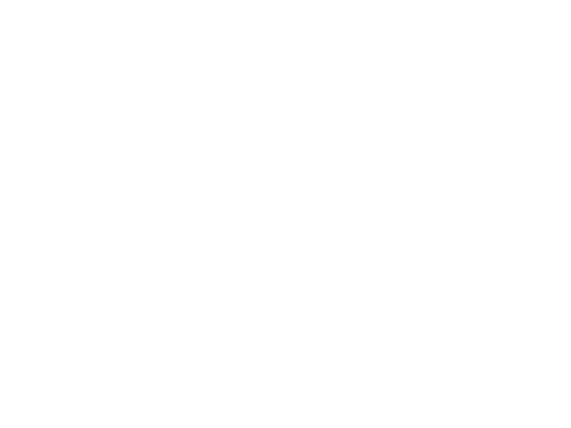
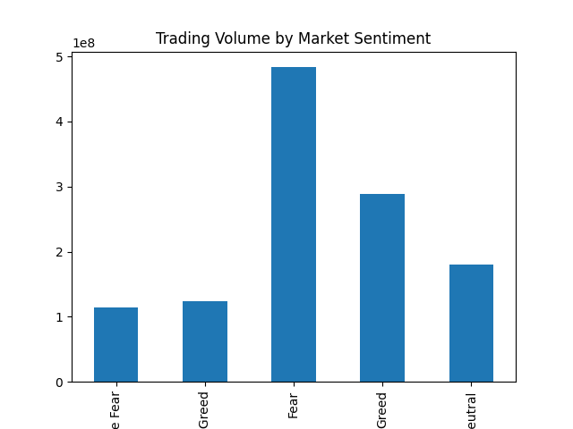
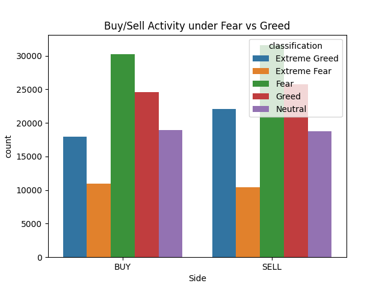
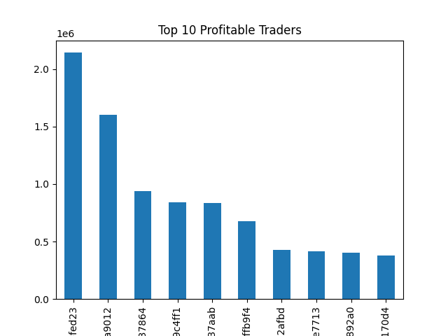
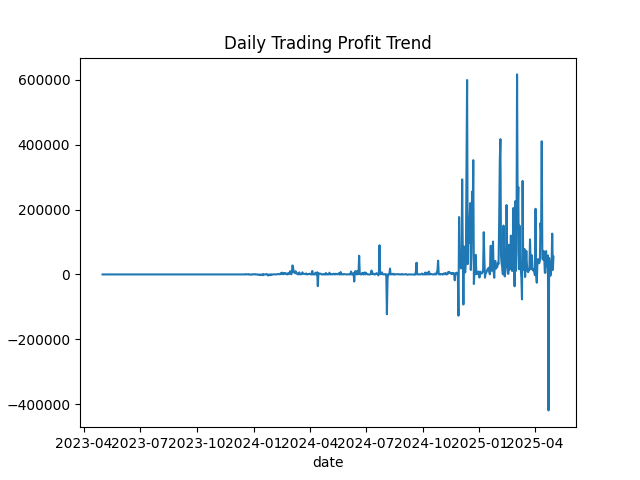

# Trader Behavior Analysis using Market Sentiment

> Exploring how Bitcoin market sentiment influences trader behavior and performance on Hyperliquid — uncovering hidden patterns to drive smarter trading strategies.

---

## Objective

Analyze the relationship between trader performance and Bitcoin market sentiment by merging Hyperliquid historical trade data with the Bitcoin Fear & Greed Index. The goal is to uncover behavioral patterns across sentiment phases (Fear, Greed, Extreme Fear, Extreme Greed, Neutral) and identify what separates profitable traders from the rest.

---

## Datasets

| Dataset | Source | Key Columns |
|---|---|---|
| Hyperliquid Historical Trades | Hyperliquid DEX | Account, Coin, Execution Price, Size USD, Side, Timestamp IST, Closed PnL, Start Position |
| Bitcoin Fear & Greed Index | Alternative.me | Date, Value, Classification (Fear / Greed) |

Both datasets were merged on a common `date` column derived from their respective timestamp fields.

---

## Project Structure

```
trader-behavior-sentiment-analysis/
├── data/
│   ├── hyperliquid_trades.csv
│   └── fear_greed_index.csv
├── notebook/
│   └── analysis.ipynb
├── visuals/
│   ├── buy_sell_behavior.png
│   ├── daily_profit_trend.png
│   ├── pnl_vs_sentiment.png
│   ├── top_traders.png
│   └── trading_volume_by_sentiment.png
├── requirements.txt
└── README.md
```

---

## Methods

### 1. Data Cleaning
- Converted `Timestamp IST` in trades to datetime using format `%d-%m-%Y %H:%M`
- Converted `date` column in sentiment dataset to datetime
- Created a common `date` column from both datasets to enable merging
- Verified and handled missing values across both datasets

### 2. Dataset Merging
Merged trading data with sentiment data using a left join on `date`, so each trade row carries the Bitcoin sentiment classification for that day.

```python
data = pd.merge(trades, sentiment, on='date', how='left')
```

### 3. Feature Engineering
- Extracted daily aggregates: total PnL per day, total volume per sentiment class
- Grouped traders by `Account` to compute cumulative PnL for top trader analysis
- Used `Side` (BUY/SELL) with sentiment classification for behavioral breakdowns

### 4. Exploratory Data Analysis
Five analyses were performed:
- Profit distribution across sentiment categories
- Trading volume by sentiment class
- Buy vs Sell activity under different sentiment conditions
- Top 10 most profitable traders by cumulative PnL
- Daily profit trend over the full dataset period

### 5. Visualization
All charts were saved to the `/visuals` folder and are displayed below.

---

## Visualizations

### Trader Profit vs Market Sentiment
> Boxplot showing the distribution of Closed PnL across sentiment categories.



---

### Trading Volume by Market Sentiment
> Total trading volume (Size USD) grouped by sentiment classification.



---

### Buy / Sell Activity under Fear vs Greed
> Count of BUY and SELL trades across all five sentiment categories.



---

### Top 10 Profitable Traders
> Traders ranked by their total cumulative Closed PnL across the entire dataset.



---

### Daily Trading Profit Trend
> Aggregated daily PnL plotted over time (2023–2025), showing the growth in market activity and volatility.



---

## Key Insights

**1. Fear drives the highest trading volume**
The Fear sentiment category accounts for the largest total trading volume (~$480M), significantly more than Greed (~$290M) or Neutral (~$180M). Traders appear to be most active when the market is fearful — likely attempting to catch rebounds or exit positions.

**2. Sell pressure increases during Greed phases**
The buy/sell chart shows that while BUY activity dominates during Fear, SELL volume catches up and even exceeds BUY volume under Extreme Greed and Greed conditions. This aligns with the classic "buy the fear, sell the greed" behavior.

**3. Profit variability spikes under extreme sentiment**
PnL spread is widest under Extreme Fear and Extreme Greed, indicating that traders take on more risk and experience both larger wins and larger losses when sentiment is at its extremes. This points to sentiment-driven over-trading.

**4. A small group of traders dominates profits**
The top 10 traders account for a disproportionately large share of total profits. The #1 trader alone accumulated over $2.1M in closed PnL. The profit curve drops steeply after the top 2, confirming a power-law distribution — a small elite drives the majority of platform gains.

**5. Trading activity scaled dramatically from 2024 onwards**
The daily profit trend shows near-zero activity from 2023 to mid-2024, followed by explosive growth with peaks exceeding $600K/day in early 2025. This reflects Hyperliquid's rapid user adoption and confirms that the 2024–2025 crypto cycle drove significant behavioral shifts.

---

## Tools Used

| Tool | Purpose |
|---|---|
| Python 3 | Core language |
| Pandas | Data manipulation and merging |
| Matplotlib | Base charting |
| Seaborn | Statistical visualizations |
| Jupyter Notebook | Interactive analysis environment |

---

## Getting Started

```bash
# Clone the repository
git clone https://github.com/your-username/trader-behavior-sentiment-analysis.git
cd trader-behavior-sentiment-analysis

# Install dependencies
pip install -r requirements.txt

# Launch the notebook
jupyter notebook notebook/analysis.ipynb
```

> **Note:** The datasets are not included in the repository due to size. Download them from the links provided in the assignment and place them inside the `data/` folder before running the notebook.

---

## Author

**Mona Agrawal**
Assignment submitted for: *Junior Data Scientist – Trader Behavior Insights*
Submitted to: saami@primetrade.ai | nagasai@primetrade.ai | chetan@primetrade.ai
CC: sonika@primetrade.ai